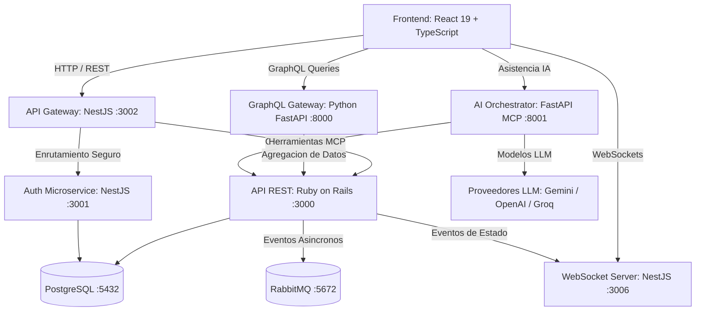

# ArquiPro - Plataforma de Conexion y Gestion Arquitectonica

ArquiPro es una solucion full stack distribuida y poliglota orientada a la conexion entre clientes y arquitectos profesionales, permitiendo la gestion integral de proyectos, supervision de obras, comunicacion en tiempo real y asistencia mediante inteligencia artificial.

---

## Arquitectura del Sistema

El sistema implementa una arquitectura distribuida basada en microservicios, APIs especializadas y comunicacion orientada a eventos.



---

## Stack Tecnologico Poliglota

| Capa / Servicio | Tecnologia | Responsabilidad Principal |
| :--- | :--- | :--- |
| **Frontend** | React 19, TypeScript, Vite, Apollo Client | Interfaz reactiva, modular y responsive con control de tipos estricto. |
| **API REST** | Ruby on Rails 7, PostgreSQL | Dominio de negocio principal, gestion de proyectos, contratos y usuarios. |
| **WebSocket Server** | NestJS, Socket.IO | Mensajeria bidireccional, chat en tiempo real y metricas en vivo. |
| **API Gateway** | NestJS, HTTP Proxy | Punto de entrada unificado y ruteo seguro para autenticacion y recursos. |
| **Auth Microservice** | NestJS, JWT, bcrypt | Emision de tokens, validacion de sesiones y control de credenciales. |
| **GraphQL Gateway** | Python, FastAPI, Strawberry | Agregacion de datos, eliminacion de over-fetching y consultas compuestas. |
| **AI Orchestrator** | Python, FastAPI, Model Context Protocol (MCP) | Asistente inteligente multimodal con ejecucion de herramientas de negocio. |
| **Infraestructura** | Docker Compose, RabbitMQ, PostgreSQL | Orquestacion contenerizada reproducible y broker de mensajeria. |

---

## Patrones de Diseno y Principios de Ingenieria

- **Single Responsibility Principle (SRP):** Desacoplamiento de componentes de interfaz y servicios de infraestructura (ej. modularizacion de serializadores y adaptadores WebSocket en Rails).
- **Strategy & Factory Pattern:** Implementado en el orquestador de inteligencia artificial para alternar de forma dinamica entre proveedores de LLM (OpenAI, Gemini, Groq).
- **Model Context Protocol (MCP):** Estandarizacion de herramientas semanticas para la invocacion de funciones operativas desde modelos de lenguaje.
- **Gateway / Aggregator:** GraphQL y NestJS Gateway centralizan y simplifican el acceso a los servicios de backend para los clientes.
- **Event-Driven Communication:** Emision de eventos en tiempo real mediante WebSockets y enrutamiento a traves de RabbitMQ.

---

## Estructura del Repositorio

```text
arqui-pro/
├── docker-compose.yml              # Orquestacion de infraestructura compartida
├── .env.example                    # Plantilla de variables de entorno del sistema
├── backend/
│   ├── APIREST/                    # Servicio central Ruby on Rails
│   ├── auth-microservicio/         # Microservicio de autenticacion NestJS
│   ├── gateway/                    # API Gateway unificado NestJS
│   ├── graphql/                    # Gateway de agregacion GraphQL en Python
│   ├── websocket/                  # Servidor de eventos y tiempo real NestJS
│   └── ai-orchestrator/            # Orquestador multimodal y herramientas MCP
└── frontend/                       # Aplicacion web cliente en React 19 y Vite
```

---

## Servicios y Puertos

| Servicio | Puerto | Descripcion |
| :--- | :--- | :--- |
| **Frontend Web** | `http://localhost:5173` | Aplicacion cliente Vite |
| **API REST (Rails)** | `http://localhost:3000` | Endpoints REST de la plataforma |
| **Auth Microservice** | `http://localhost:3001` | Microservicio de autenticacion |
| **API Gateway** | `http://localhost:3002` | Gateway principal HTTP |
| **WebSocket Server** | `http://localhost:3006` | Servidor de sockets en tiempo real |
| **GraphQL Gateway** | `http://localhost:8000` | Playground y consultas GraphQL |
| **AI Orchestrator** | `http://localhost:8001` | Servidor MCP y agente inteligente |
| **RabbitMQ Management**| `http://localhost:15672` | Consola de monitoreo de mensajeria |
| **PostgreSQL** | `localhost:5432` | Base de datos relacional principal |

---

## Guia de Puesta en Marcha

### 1. Requisitos Previos

- Docker y Docker Compose v2+
- Node.js v20+ / Bun
- Ruby 3.2+ y Bundler (para desarrollo local en Rails)
- Python 3.10+ (para desarrollo local en GraphQL y AI Orchestrator)

### 2. Infraestructura con Docker

Para levantar los servicios de soporte (Base de Datos PostgreSQL, RabbitMQ y n8n):

```bash
# Copiar configuracion de entorno
cp .env.example .env

# Iniciar contenedores de infraestructura
docker compose up -d
```

### 3. Ejecucion de Servicios de Backend

#### API REST (Ruby on Rails)
```bash
cd backend/APIREST
bundle install
rails db:migrate db:seed
rails server -p 3000
```

#### Microservicios NestJS (Auth, Gateway, WebSocket)
```bash
# Servidor WebSocket
cd backend/websocket
npm install
npm run build
npm start

# Servidor Gateway
cd ../gateway
npm install
npm start

# Microservicio Auth
cd ../auth-microservicio
npm install
npm start
```

#### Servicios Python (GraphQL y AI Orchestrator)
```bash
# GraphQL Gateway
cd backend/graphql
python -m venv venv && source venv/bin/activate
pip install -r requirements.txt
uvicorn main:app --reload --port 8000

# AI Orchestrator
cd ../ai-orchestrator
python -m venv venv && source venv/bin/activate
pip install -r requirements.txt
uvicorn main:app --reload --port 8001
```

### 4. Ejecucion del Frontend

```bash
cd frontend
npm install
npm run build
npm test
npm run dev
```

---

## Verificacion y Calidad de Codigo

El proyecto cuenta con suites de pruebas unitarias y de integracion en sus distintos modulos:

- **Frontend:** Validacion de tipos TypeScript (`tsc -b`) y empaquetado optimizado mediante Vite.
- **WebSocket Gateway:** Pruebas unitarias de gateways y servicios mediante Jest (`npm test`).
- **Python Services:** Validacion de sintaxis y tipado estricto con Python y Pydantic.
- **Modularidad:** Todos los componentes y modulos cumplen el limite estricto de 400 lineas por archivo y cero dependencias de caracteres informales o emojis en codigo fuente.

---

## Licencia

Este proyecto esta bajo la Licencia MIT.
